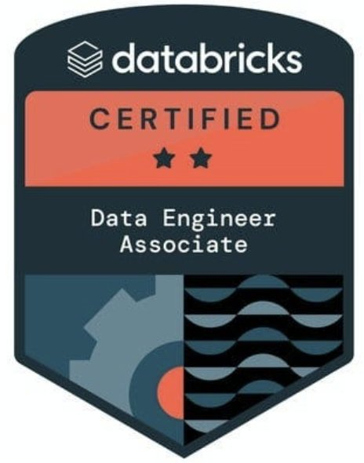
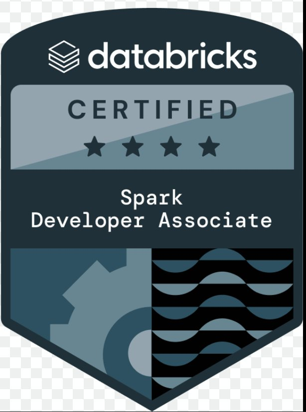
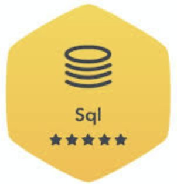

<div align="center">

<!-- MATRIX HEADER WAVE -->


<br/>

<!-- TYPING ANIMATION -->
[](https://git.io/typing-svg)

<br/>

<!-- PROFILE STATS ROW -->

[](https://github.com/ramanbarnwalgit81)


</div>

---

<!-- NEON DIVIDER -->


# `◈ INITIALIZE_PROFILE.exe`

<table>
<tr>
<td valign="middle" width="55%">

<table>
  <tr><td colspan="2" align="center"><b>〔 SYSTEM IDENTIFICATION 〕</b></td></tr>
  <tr><td><b>NAME</b></td><td>Raman Barnwal</td></tr>
  <tr><td><b>RANK</b></td><td>Senior Data Engineer</td></tr>
  <tr><td><b>XP</b></td><td>8+ Years</td></tr>
  <tr><td><b>DOMAIN</b></td><td>Healthcare / Insurance / Renewable Energy</td></tr>
  <tr><td><b>NODE</b></td><td>Texas Tech University</td></tr>
  <tr><td><b>DEGREE</b></td><td>MS Data Science (May 2026)</td></tr>
  <tr><td><b>STATUS</b></td><td></td></tr>
</table>

</td>
<td valign="middle" width="45%" align="center">


</td>
</tr>
</table>

<br/>

---

### `▸ DEPLOYMENT LOG`

<table>
<tr>
<td width="33%" valign="top">

**🔷 ALLSTATE**

Architected real-time pipelines with PySpark & Kafka ingesting **500M+ daily records**. Built reusable ETL frameworks cutting dev time **↓30%** and compute costs **↓60%**. Boosted ML pipeline accuracy **↑25%**. Deployed with CI/CD, Docker & Kubernetes.

</td>
<td width="33%" valign="top">

**🔶 BLUE CROSS BLUE SHIELD** *(via Accenture)*

Engineered ETL pipelines processing **10TB+ of healthcare data**, hitting **99.5% uptime**, slashing query time **↓60%** via partitioning, compression & Airflow orchestration.

</td>
<td width="33%" valign="top">

**🟣 NATIONAL WIND INSTITUTE @ TTU**

Developing ML models & hurricane-pattern simulations to predict power-grid outages and support renewable energy research.

</td>
</tr>
</table>


---

## `◈ ACTIVE_PROCESSES.log`

```python
active_missions = {
    "🔬 RESEARCH.exe"      : "ML + hurricane simulations → power-grid outage prediction @ NWI",
    "🧠 NEURAL_UPGRADE"    : "Deepening mastery of LLM-powered pipelines & AI-augmented ETL",
    "📖 KNOWLEDGE_BASE"    : "MS in Data Science — Texas Tech University (May 2026)",
    "⚗️  R&D_LAB"          : "Exploring dbt + Snowflake Cortex for AI-native transformations",
}

print("All processes nominal. Standing by for next mission.")
```


---

## `◈ COMM_CHANNELS.cfg`

<div align="center">

[](https://linkedin.com/in/raman-barnwal-bhole81)
[](mailto:barnwal.raman@outlook.com)
[](mailto:contactramanpsna@gmail.com)
[](https://instagram.com/raman_barnwal81)
[](tel:+18065595261)

</div>


---

## `◈ CERTIFICATION_MATRIX.db`

<div align="center">

<table>
  <tr>
    <td align="center" width="200">
      <br/>
      <b>Data Engineer Associate</b><br/>
      <sub>🔶 Databricks · Oct 2025</sub>
    </td>
    <td align="center" width="200">
      <br/>
      <b>Spark Developer Associate</b><br/>
      <sub>🔶 Databricks</sub>
    </td>
    <td align="center" width="200">
      <br/>
      <b>Fabric Data Engineer Associate</b><br/>
      <sub>🔷 Microsoft Certified</sub>
    </td>
    <td align="center" width="200">
      <br/>
      <b>Azure Data Fundamentals</b><br/>
      <sub>🔷 Microsoft Certified</sub>
    </td>
  </tr>
  <tr>
    <td align="center" width="200">
      <br/>
      <b>Data Scientist Associate</b><br/>
      <sub>🟢 DataCamp · Jul 2025</sub>
    </td>
    <td align="center" width="200">
      <br/>
      <b>Data Engineer with Python</b><br/>
      <sub>🟢 DataCamp · Jul 2025</sub>
    </td>
    <td align="center" width="200">
      <br/>
      <b>Python — Gold Badge ⭐⭐⭐⭐⭐</b><br/>
      <sub>🟩 HackerRank · 5 Stars</sub>
    </td>
    <td align="center" width="200">
      <br/>
      <b>SQL — Gold Badge ⭐⭐⭐⭐⭐</b><br/>
      <sub>🟩 HackerRank · 5 Stars</sub>
    </td>
  </tr>
</table>

</div>


---

## `◈ TECH_STACK.sys`

<div align="center">

### ⚡ `[ LANGUAGES ]`


### ☁️ `[ CLOUD PLATFORMS ]`


### 🔄 `[ DATA ENGINEERING ]`


### 🗄️ `[ DATABASES ]`


### 🤖 `[ AI / ML ARSENAL ]`


### 📊 `[ VISUALIZATION ]`


### ⚙️ `[ DEVOPS / AUTOMATION ]`


</div>


---

## `◈ ACHIEVEMENT_TOKENS.unlocked`

<div align="center">

<table>
  <tr>
    <td align="center" width="300">
      <br/><br/>
      <b>Rawls Endowed Graduate Scholarship</b><br/>
      <sub>MS in Data Science · Texas Tech University</sub>
    </td>
    <td align="center" width="300">
      <br/><br/>
      <b>Star Performer Award</b><br/>
      <sub>Exceptional delivery & performance · Allstate Insurance</sub>
    </td>
  </tr>
  <tr>
    <td align="center" width="300">
      <br/><br/>
      <b>The XtraMiler Award</b><br/>
      <sub>Going above and beyond · Accenture Solutions</sub>
    </td>
    <td align="center" width="300">
      <br/><br/>
      <b>Full Merit Scholarship (2011–2015)</b><br/>
      <sub>Bachelor of Engineering · Government of India</sub>
    </td>
  </tr>
  <tr>
    <td align="center" width="300">
      <br/><br/>
      <b>Best Paper Award</b><br/>
      <sub>Research Excellence · Academic Conference</sub>
    </td>
    <td align="center" width="300">
      <br/><br/>
      <b>Mr. RYLA</b><br/>
      <sub>Rotary Youth Leadership Award · Rotary International</sub>
    </td>
  </tr>
</table>

</div>


---

## `◈ TELEMETRY_DASHBOARD.monitoring`

<div align="center">


<br/>


</div>


---

<div align="center">

[](https://visitcount.itsvg.in)

<!-- FOOTER WAVE -->


*`> Pipeline compiled. Runtime: optimal. Powered by caffeine & data engineering. 🚀⚡`*

</div>
